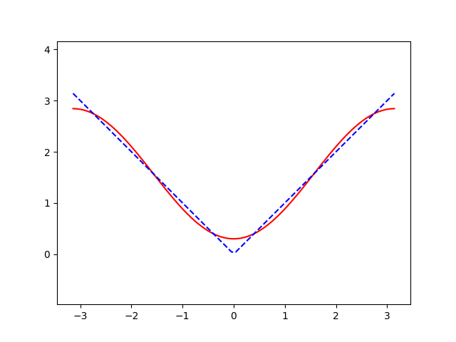

# Least-Squares-Rule
Approximate a given function by base-function list using least squares, gauss-seidel and simpson rules

### Fourier serial as an example


### Results:
```
x1 = 3.9374024864306056
x2 = -2.256757747521504
x3 = 1.594845137354704e-16

ERROR: 0.27341
```


### References:
- Numerical Integration: [Wikipedia](https://en.wikipedia.org/wiki/Numerical_integration)
- Gauss-Seidel Method: [Wikipedia](https://en.wikipedia.org/wiki/Gauss%E2%80%93Seidel_method)
- Least squares: [Wikipedia](https://en.wikipedia.org/wiki/Least_squares)

### How to Run:
`python main.py`

